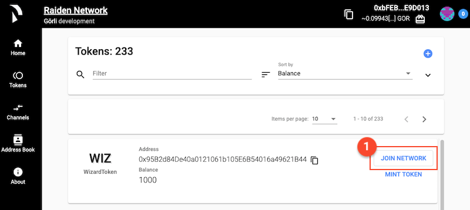
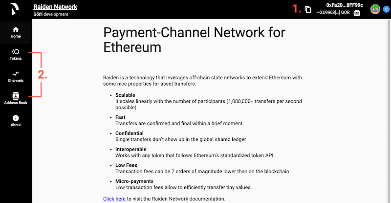
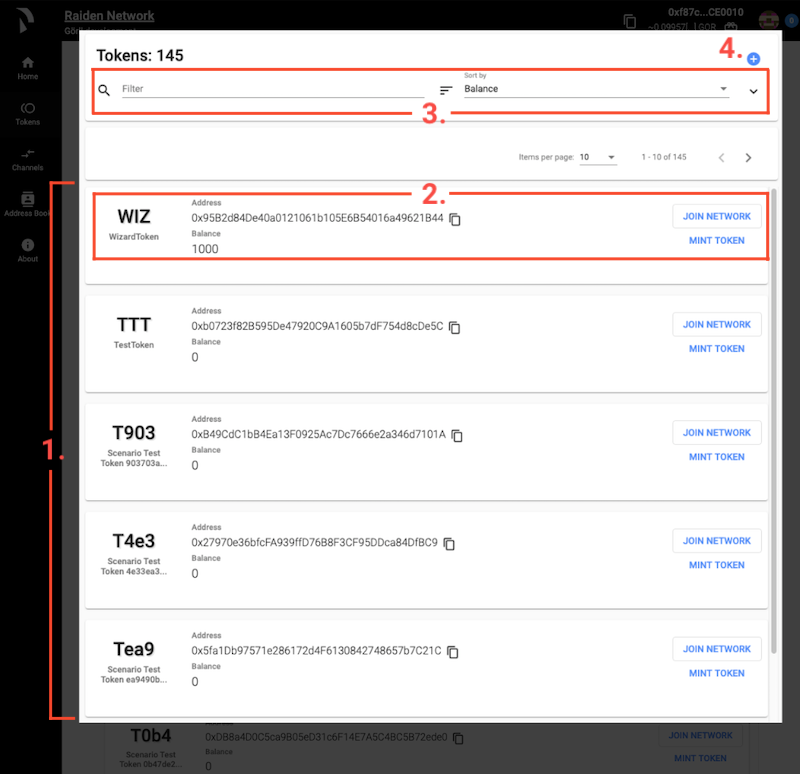

# The Raiden Web Application

* Join a token network
* Make a payment
* Close and Settle

### Join a Token Network

Navigate to the **"Tokens"** Screen. You need to join a token network for the specific token you're interested in doing payments with. To do so, you can either:

* [Join an existing token network](the-raiden-web-interface.md#join-an-existing-token-network)
* [Register a new token and join its network](the-raiden-web-interface.md#register-a-new-token-and-join-its-network)


**What is a token network?**


#### Join an Existing Token Network

1. Choose the token which network you want to join from the list of available tokens and press the **"JOIN NETWORK"** button
2. Enter the amount of tokens you want to allocate and click **"Join"**. This amount is what will be made available for making payments and you can always [add more funds later](the-raiden-web-interface.md#add-funds)

You're now ready to [make a payment](the-raiden-web-interface.md#make-a-payment)!

#### Register a New Token and Join Its Network

1. Press the upper right **"+"** button
2. Enter the address of the token you want to register and click **"Register"**

You're now ready to [make a payment](the-raiden-web-interface.md#make-a-payment)!

### Make a Payment

When you joined a token network three channels were automatically opened with three random nodes and you now have the possibility to start making payments.

Let's walk through how to:

* [Pay from the tokens screen](the-raiden-web-interface.md#pay-from-the-tokens-screen)
* [Pay from the channels screen](the-raiden-web-interface.md#pay-from-the-channels-screen)
* [Add funds](the-raiden-web-interface.md#add-funds)


**What is a channel?**

A channel or payment channel allows Raiden transfers to be made back and forth between parties without involving the actual blockchain.

This works by first creating an initial on-chain deposit with the amount you specified when joining a token network. 60% of that amount is evenly distributed across the three channels \(20% per channel\) and the remaining 40% are reserved **&lt;-- ! ! ! !???? Allows to make payment to people that you don't have a direct channel with.**

The net sum can then be used in the Raiden off-chain transactions and the actual blockchain only needs to be involved in the initial setup or if we choose to deposit more tokens or settle a netted amount.


#### Pay from the Tokens Screen

1. Press the **"PAY"** button that has now been made available for the token network you've joined
2. In the pay popup dialogue:
   * Enter the address of the one who will be receiving your payment
   * Select the token associated with the token network you're making the payment from
   * Enter the payment amount
   * You can choose to fill in any number in the **"Set payment identifier"** dropdown for identifying your payment. If no number is provided your payment identifier will default to a timestamp
   * Click **"Send"** to complete your payment

#### Pay from the Channels Screen

1. Press either the **"PAY"** button or the **"SEND TOKENS"** button. Both will bring up the same pay popup dialogue with the difference that the **"PAY"** button gives you some pre-filled values
2. In the pay popup dialogue:
   * Enter the address of the one who will be receiving your payment
   * Select the token associated with the token network your channel belongs to
   * Enter the payment amount
   * You can choose to fill in any number in the **"Set payment identifier"** dropdown for identifying your payment. If no number is provided your payment identifier will default to a timestamp
   * Click **"Send"** to complete your payment

#### Add Funds

To allocate more tokens you can either:

1. Click the **"ADD FUNDS"** button next to the token network you want to allocate more tokens for. You have to provide a higher amount than previously, if you initially provided 10 tokens the new amount needs to exceed that number
2. Click the **"DEPOSIT"** button for a channel to add a token amount of your choosing to that specific channel

### Close and Settle

You have a couple of options for depositing tokens back to your token network balance:

* [Withdraw tokens](the-raiden-web-interface.md#withdraw-tokens)
* [Close a channel and settle the token amount](the-raiden-web-interface.md#close-a-channel-and-settle-the-token-amount)
* [Leave a token network, close all channels and settle the token amount](the-raiden-web-interface.md#leave-a-token-network-close-all-channels-and-settle-the-token-amount)

#### Withdraw Tokens

1. Click the **"WITHDRAW"** button for the channel you'd like to withdraw tokens from
2. Enter the amount you wish to withdraw based on the current balance for that specific channel and click **"Confirm"**. The amount will be returned to your token network balance

#### Close a Channel and Settle the Token Amount

1. Click the **"CLOSE"** button for the channel you'd like to close
2. Click **"Confirm"** to finalize closing the channel. When a channel has been closed no more payments can be carried out using that channel and the tokens will be settled and payed out to the participating nodes

#### Leave a Token Network, Close all Channels and Settle the Token Amount

1. Click **"LEAVE NETWORK"** for the token network you'd like to leave
2. Click **"Confirm"** to finalize leaving the network. The same thing will happen here as if you would choose to close a channel with the difference that leaving the network will automatically close and settle all channels that belong to that network

### 

**USE this screen will be empty on the overview of the WebUI page**

The main things you would want to do when using Raiden, let's walk through that flow... Join a Token Network, Make a Payment, Close a Channel and Settle. In the process you will learn what tokens, token networks and channels are

When I re-allocate tokens is any of my ETH consumed because it is syncing the newly allocated amount to the blockchain?

**What is  the use case for providing your own tokens is it for people who build on Raiden? - Need to deploy a smart contract.**

### 

#### 

## **Overview**

This tutorial will teach you to:

* [Navigate the WebUI](the-raiden-web-interface.md#navigate-the-webui)
* Register tokens
* Join a token network
* Make a Raiden payment

### **Navigate the WebUI**

The first screen you'll see when the WebUI launches is the **Home Screen** with a short introduction to Raiden. On the top bar and left hand side you'll find:

1. The address of your Raiden node
2. Navigation for interacting with Raiden. The menu options we will be focusing on are:

* [Tokens](the-raiden-web-interface.md#tokens)
* [Channels](the-raiden-web-interface.md#channels)
* [Address Book](the-raiden-web-interface.md#address-book)

#### **Tokens**

In **Tokens** you'll find:

1. A list of all tokens that have been registered in Raiden
2. Details about each token which includes:
   * The token **Symbol** \(**WIZ** in the example screenshot\)
   * The token **Name** \(**WizardToken** in the example screenshot\)
   * Your current **Balance** of a specific token
   * Buttons where you can **Join Network** or **Mint Token**
3. A **Filter** field where you can search for a registered token by its name or address and a **Sort by** dropdown for sorting your list of tokens
4. A **+** button where you can register tokens


**What is a token and a token network?**


#### Channels

In **Channels** you'll find:

1. A list of all your open channels
2. Details about each open channel which includes:
   * The address of the **Partner** node that you have an open channel with
   * The address of the token when you hover over the token symbol \(**WIZ** in the example screenshot\)
   * The current token **Balance** of your Raiden node for a specific channel
   * Your channels **Status** \(Opened, Closed or Settled\)
   * Buttons where you can **Pay**, **Deposit**, **Withdraw** or **Close** a channel
3. A **Filter** field where you can search for a channel by partner name or address and a **Sort by** dropdown for sorting your list of channels
4. A **+** button where you can open a channel with a counterpart of your choosing


**Add note on initial empty screen**



**What is a Channel?**

A channel or payment channel allows Raiden transfers to be made back and forth between parties without involving the actual blockchain.

This works by first creating an initial on-chain deposit of a set amount. The net sum of this amount can then be used in the Raiden off-chain transactions.

We only need to involve the actual blockchain in the initial setup or if we choose to close a channel and settle the netted amount.


#### Address Book

In the **Address Book** you'll find:

1. A list of all your saved addresses
2. Two options for saving new addresses:
   * Type the address and label manually
   * Drag and drop a JSON file containing your addresses

