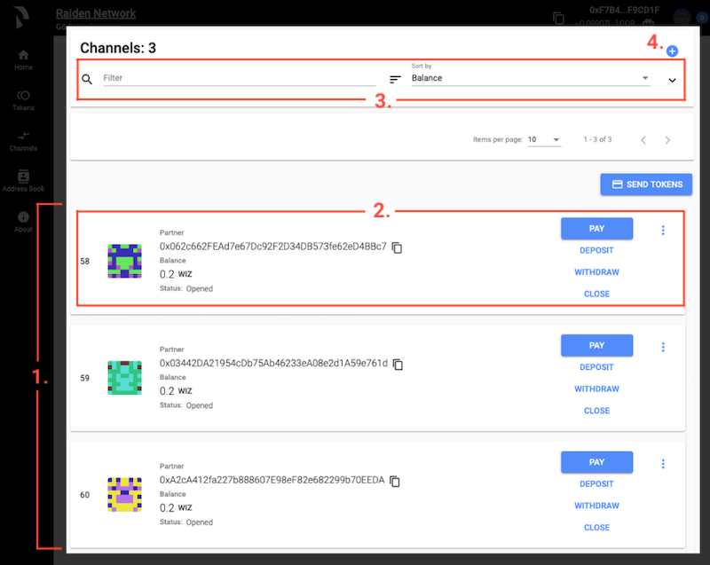

# The Raiden Web Application

## **Overview**

This tutorial will teach you to:

* [Navigate the WebUI](the-raiden-web-interface.md#navigate-the-webui)
* Register tokens
* Join a token network
* Make a Raiden payment

### **Navigate the WebUI**

The first screen you'll see when the WebUI launches is the **Home Screen** with a short introduction to Raiden. On the top bar and left hand side you'll find:

1. The address of your Raiden node
2. Navigation for interacting with Raiden. The menu options we will be focusing on are:

* [Tokens](the-raiden-web-interface.md#tokens)
* [Channels](the-raiden-web-interface.md#channels)
* [Address Book](the-raiden-web-interface.md#address-book)

#### **Tokens**

In **Tokens** you'll find:

1. A list of all tokens that have been registered in Raiden
2. Details about each token which includes:
   * The token **Symbol** \(**WIZ** in the example screenshot\)
   * The token **Name** \(**WizardToken** in the example screenshot\)
   * Your current **Balance** of a specific token
   * Buttons where you can **Join Network** or **Mint Token**
3. A **Filter** field where you can search for a registered token by its name or address and a **Sort by** dropdown for sorting your list of tokens
4. A **+** button where you can register tokens


**What is a token and a token network?**


#### Channels

In **Channels** you'll find:

1. A list of all your open channels
2. Details about each open channel which includes:
   * The address of the **Partner** node that you have an open channel with
   * The address of the token when you hover over the token symbol \(**WIZ** in the example screenshot\)
   * The current token **Balance** of your Raiden node for a specific channel
   * Your channels **Status** \(Opened, Closed or Settled\)
   * Buttons where you can **Pay**, **Deposit**, **Withdraw** or **Close** a channel
3. A **Filter** field where you can search for a channel by partner name or address and a **Sort by** dropdown for sorting your list of channels
4. A **+** button where you can open a channel with a counterpart of your choosing


**Add note on initial empty screen**



**What is a Channel?**

A channel or payment channel allows Raiden transfers to be made back and forth between parties without involving the actual blockchain.

This works by first creating an initial on-chain deposit of a set amount. The net sum of this amount can then be used in the Raiden off-chain transactions.

We only need to involve the actual blockchain in the initial setup or if we choose to close a channel and settle the netted amount.


#### Address Book

In the **Address Book** you'll find:

1. A list of all your saved addresses
2. Two options for saving new addresses:
   * Type the address and label manually
   * Drag and drop a JSON file containing your addresses

