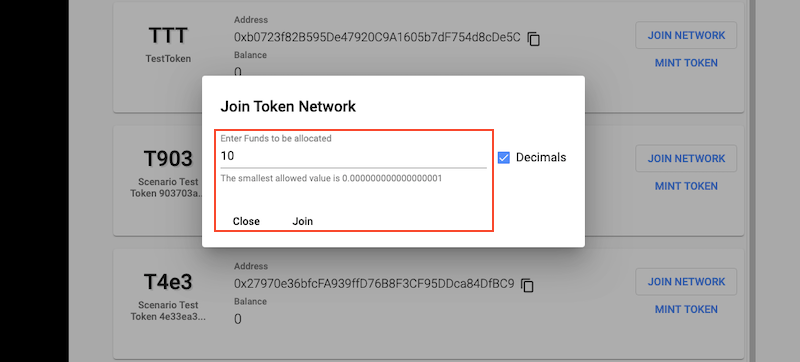
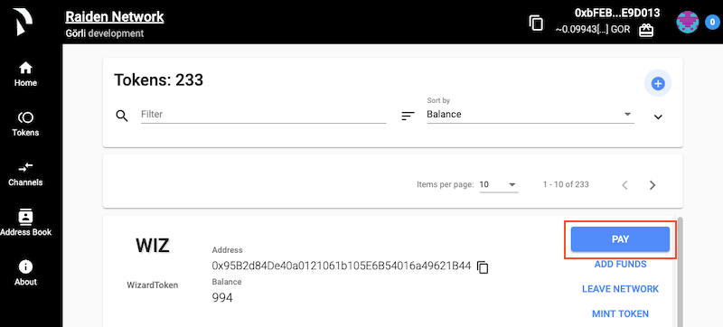
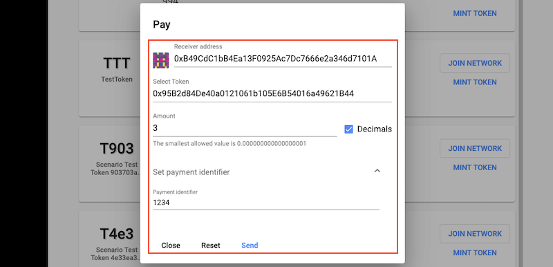
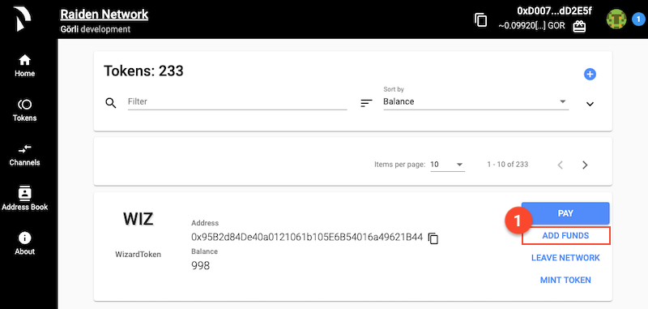
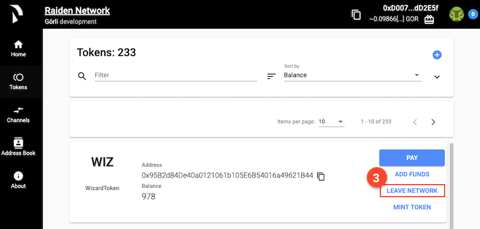
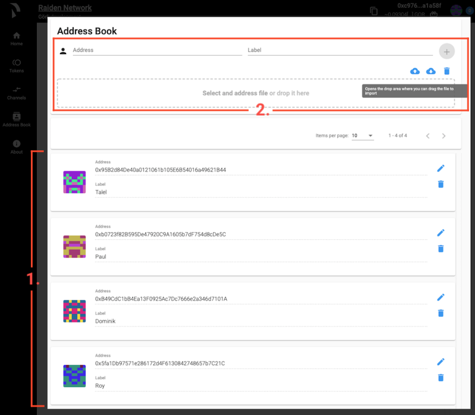

# The Raiden Web Application

* [Join a token network](the-raiden-web-interface.md#join-a-token-network-1)
* [Make a payment](the-raiden-web-interface.md#make-a-payment)
* [Close channels and settle payments](the-raiden-web-interface.md#close-channels-and-settle-payments)

### Join a Token Network

You need to join a token network for the token you're interested in doing payments with. To do so, navigate to the **"Tokens"** screen, there you can choose to either:

* [Join an existing token network](the-raiden-web-interface.md#join-an-existing-token-network)
* [Register a new token and join its network](the-raiden-web-interface.md#register-a-new-token-and-join-its-network)


**What is a token network? &lt;-- SUMMARIZE NOTES FOR THIS**


#### Join an Existing Token Network

1. Click the **"JOIN NETWORK"** button next to the token which network you want to join.
2. Enter the the amount of tokens you want to allocate and click **"Join"**. The amount you choose is what will be available for making payments and you can always [add more funds later](the-raiden-web-interface.md#add-more-tokens).

You're now ready to [make a payment](the-raiden-web-interface.md#make-a-payment)!

#### Register a New Token and Join Its Network

1. Click the upper right **"+"** button.
2. Enter the address of the token you want to register and click **"Register"**.

You're now ready to [make a payment](the-raiden-web-interface.md#make-a-payment)!

### Make a Payment

When you joined a token network three channels were automatically opened with three random nodes and you now have a possibility to start making payments.

Let's walk through how to:

* [Pay from the tokens screen](the-raiden-web-interface.md#pay-from-the-tokens-screen)
* [Add more tokens](the-raiden-web-interface.md#add-more-tokens)


**What is a channel? &lt;-- WORK MORE ON**

A channel or payment channel allows Raiden transfers to be made back and forth between parties without involving the actual blockchain.

This works by first creating an initial on-chain deposit with the amount you specified when for instance joining a token network. 60% of that amount gets evenly distributed across the three channels \(20% per channel\) and the remaining 40% are reserved for when someone wants to open a channel with us.

The net sum can then be used in the Raiden off-chain transactions and the actual blockchain only needs to be involved in the initial setup or if we choose to deposit more tokens or settle a netted amount.

In Raiden theses channels make up routes from which transfers can be made this means that two peers do not have to have a direct connection to send payments between each other as long as there are some routes connecting them.


#### Pay from the Tokens Screen

1. Click the **"PAY"** button that has now been made available for the token network you've joined.
2. In the popup dialogue:
   * Enter the address of the receiver for your payment.
   * Select the token associate with the token network you're making the payment from.
   * Enter the amount you want to pay.
   * You can choose to fill in any number in the **"Set payment identifier"** dropdown for identifying your payment. If nothing is provided your payment identifier will default to a timestamp.
   * Click **"Send"** to complete your payment.

#### Add More Tokens

You have two alternatives to choose from for allocating more tokens to your channels:

1. Click the **"ADD FUNDS"** button in the **"Tokens"** screen next to the token network you want to allocate more tokens for. When asked to enter a number you need to provide a higher amount than what is currently allocated. Say you already have 10 tokens, then your new amount needs to exceed that number. This is because the sum gets redistributed across your open channels. If you were to provide the same amount there won't really be anything new to redistribute.
2. Click the **"DEPOSIT"** button in the **"Channels"** screen next to the channel you want to deposit more tokens in. This gives you the option to allocate a number of tokens to a specific channel only instead of distributing the amount across all your channels.

### Close Channels and Settle Payments

You have a couple of options for depositing tokens back to your token network balance. To do so you can choose to either:

1. **Withdraw tokens**

   Click the **"WITHDRAW"** button in the **"Channels"** screen next to the channel from which you want to make the withdraw. Enter the amount you wish to withdraw and click **"Confirm"**. The tokens will get added to your token network balance.

2. **Close a channel**

   Click the **"CLOSE"** button in the **"Channels"** screen next to the channel you want to close. When you click **"Confirm"** the channel will no longer be available for making payments and the netted token amount will be settled against all channel participants.

3. **Leave a network**

   Click the **"LEAVE NETWORK"** button in the **"Tokens"** screen next to the token network you want to leave. Leaving a network does the same as closing a channel with the difference that _all_ channels are closed for the token network you choose to leave.

**USE this screen will be empty on the overview of the WebUI page**

The main things you would want to do when using Raiden, let's walk through that flow... Join a Token Network, Make a Payment, Close a Channel and Settle. In the process you will learn what tokens, token networks and channels are

When I re-allocate tokens is any of my ETH consumed because it is syncing the newly allocated amount to the blockchain?

**What is  the use case for providing your own tokens is it for people who build on Raiden? - Need to deploy a smart contract.**

### 

#### 

## **Overview**

This tutorial will teach you to:

* [Navigate the WebUI](the-raiden-web-interface.md#navigate-the-webui)
* Register tokens
* Join a token network
* Make a Raiden payment

### **Navigate the WebUI**

The first screen you'll see when the WebUI launches is the **Home Screen** with a short introduction to Raiden. On the top bar and left hand side you'll find:

1. The address of your Raiden node
2. Navigation for interacting with Raiden. The menu options we will be focusing on are:

* [Tokens](the-raiden-web-interface.md#tokens)
* [Channels](the-raiden-web-interface.md#channels)
* [Address Book](the-raiden-web-interface.md#address-book)

#### **Tokens**

In **Tokens** you'll find:

1. A list of all tokens that have been registered in Raiden
2. Details about each token which includes:
   * The token **Symbol** \(**WIZ** in the example screenshot\)
   * The token **Name** \(**WizardToken** in the example screenshot\)
   * Your current **Balance** of a specific token
   * Buttons where you can **Join Network** or **Mint Token**
3. A **Filter** field where you can search for a registered token by its name or address and a **Sort by** dropdown for sorting your list of tokens
4. A **+** button where you can register tokens


**What is a token and a token network?**


#### Channels

In **Channels** you'll find:

1. A list of all your open channels
2. Details about each open channel which includes:
   * The address of the **Partner** node that you have an open channel with
   * The address of the token when you hover over the token symbol \(**WIZ** in the example screenshot\)
   * The current token **Balance** of your Raiden node for a specific channel
   * Your channels **Status** \(Opened, Closed or Settled\)
   * Buttons where you can **Pay**, **Deposit**, **Withdraw** or **Close** a channel
3. A **Filter** field where you can search for a channel by partner name or address and a **Sort by** dropdown for sorting your list of channels
4. A **+** button where you can open a channel with a counterpart of your choosing


**Add note on initial empty screen**



**What is a Channel?**

A channel or payment channel allows Raiden transfers to be made back and forth between parties without involving the actual blockchain.

This works by first creating an initial on-chain deposit of a set amount. The net sum of this amount can then be used in the Raiden off-chain transactions.

We only need to involve the actual blockchain in the initial setup or if we choose to close a channel and settle the netted amount.


#### Address Book

In the **Address Book** you'll find:

1. A list of all your saved addresses
2. Two options for saving new addresses:
   * Type the address and label manually
   * Drag and drop a JSON file containing your addresses

