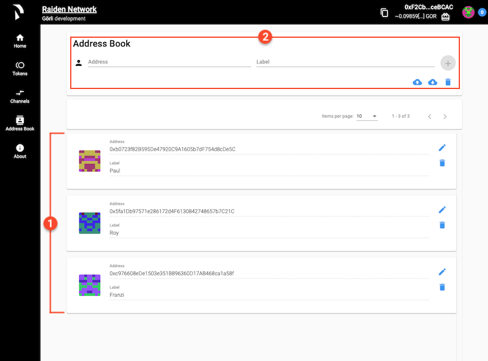

# Navigate the WebUI

The first screen you will see when the WebUI launches is the **"Home"** screen which has a short introduction to Raiden.

On the top bar and left hand side you'll find:

1. The address of you Raiden node together with your current ETH balance. Some of this ETH gets consumed anytime an on-chain activity happens.
2. The navigation menu for interacting with Raiden.

The menu options we will be focusing on are:

* [Tokens](screens.md#tokens-1)
* [Channels](screens.md#channels)
* [Address Book](screens.md#address-book)

## Tokens

In order to open a channel and start making payments you need to be connected to a token network. Each ERC20 token has its own token network.

1. List of all tokens that have been registered in Raiden.
2. Details about each token which includes:
   * The token **symbol** \(WIZ\)
   * The token **name** \(WizardToken\)
   * Your current token **balance**
   * Buttons where you can [**join a network**](join-a-token-network.md) or [**mint tokens**](payment.md)\*\*\*\*
3. **+** button for [**registering new tokens**](join-a-token-network.md#register-a-new-token-and-join-its-network) and options for **filtering** and **sorting** your tokens list

## Channels

To make payments you need to have a channel with at least one other Raiden node.


If you have no channels open this screen will display a _"no channels found"_ message. The simplest way to get started is to open channels by [joining a token network](join-a-token-network.md).


1. List of all your open channels.
2. Details about each open channel which includes:
   * The address of the **partner** node you're connected to via the channel
   * The token **symbol** \(WIZ\) and the token **address** which gets displayed when hovering over the symbol
   * Your current **balance** of tokens in the channel
   * The **status** of your channel and whether it is **open**, **closed**, or **settled**
   * Buttons where you can [**pay**](payment.md) ****\(both the "PAY" and the "SEND TOKENS" button works the same as when paying from the "Tokens" screen after joining a token network\), [**deposit**](add-more-tokens.md), [**withdraw**](close-channels-and-settle-payments.md), or [**close a channel**](close-channels-and-settle-payments.md)\*\*\*\*
3. A **+** button for opening a channel with a counterpart of your choosing and options for **filtering** and **sorting** your channels list

## Address Book

The address book gives you the possibility to save and label addresses you use often.

1. List of all your saved peers and their addresses.
2. Two options for saving a new address:
   * Type the address and label manually
   * Drag and drop a JSON file containing all your addresses

